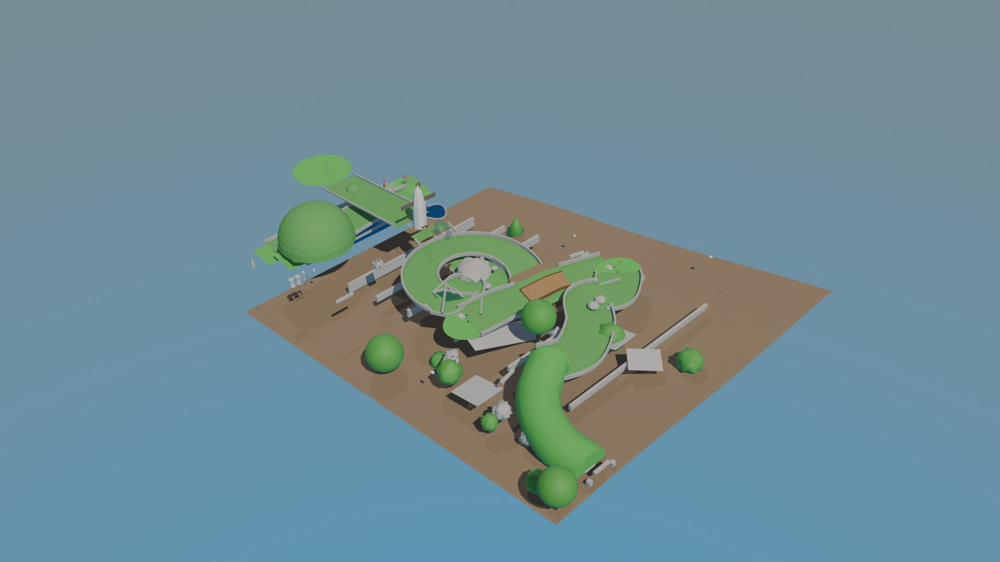

# Eskdale Green Mini Golf Course

A 9-hole miniature golf course modelled in **Blender 5.0** as a construction-planning
and visualization deliverable. The course is geolocated to a real site at **Fairfield,
Eskdale Green, Cumbria** (54.3876, -3.3224) and cut into the actual hillside using
SRTM elevation data and OpenStreetMap context.



## What this is

A tiered, naturalistic English-garden mini golf course descending ~3m over 9 holes
within a 15m x 10m footprint. The signature hole (Hole 5, "The Windmill") features a
vertical loop-de-loop feeding a Dutch-style windmill with rotating blades. The model
is built procedurally by Python scripts that drive Blender over a websocket bridge,
then emplaced onto a real-world Digital Elevation Model (DEM) of the site.

- **Design brief:** [`docs/prd.md`](docs/prd.md) — full hole-by-hole specification,
  elevation profile, and success criteria.
- **Design decisions:** [`docs/adr/index.md`](docs/adr/index.md) — Architecture
  Decision Records (terrain approach, hole geometry, windmill mechanism, materials,
  landscaping, elevation/scale, and more).
- **Domain model:** [`docs/ddd/`](docs/ddd/) — bounded contexts, aggregates,
  entities, and value objects for the course.

## Deliverables

| Artifact | Location |
|----------|----------|
| Blender scene | `minigolf_course.blend` |
| Final still renders | `renders/final_*.jpg`, `renders/reposition_*.jpg`, `renders/terrain_*.jpg` |
| Orbit flythrough | `renders/orbit_flythrough.mp4` |
| Terrain flythrough | `renders/terrain_flythrough.mp4` |
| Earlier flythroughs | `renders/flythrough_v2.mp4`, `renders/flythrough_video.mp4` |

## Prerequisites

- **Blender 5.0** with the [blender-mcp](https://github.com/DreamLab-AI) server
  running. The MCP server is launched via [`.mcp.json`](.mcp.json)
  (`uvx blender-mcp`, listening on `BLENDER_PORT=8765`). Scripts talk to Blender
  through the websocket bridge in [`scripts/blender_ws.py`](scripts/blender_ws.py)
  (`BLENDER_WS_URL`, default `ws://127.0.0.1:8765`).
- **Host-side Python deps** for the DEM/texture/websocket tooling:

  ```bash
  python3 -m pip install -r requirements.txt
  ```

  (Blender-internal modules `bpy`, `bmesh`, `mathutils` are provided by Blender
  itself and are not pip-installed.)

## Build pipeline

Run the scripts in this order against a live Blender + blender-mcp session:

1. **Fetch real-world site data**
   - `scripts/fetch_dem.py` — download the SRTM DEM tile for the site.
   - `scripts/fetch_fairfield.py` — fetch OSM context and build the terrain texture.
2. **Emplace terrain**
   - `scripts/emplace_terrain.py` — build the hillside mesh from the DEM and
     georeference the scene.
   - `scripts/terrain_and_place.py` / `scripts/reposition_golf.py` — position the
     course into the cut hillside.
3. **Build the holes**
   - `scripts/build_holes_2_4.py`, `scripts/build_hole_5.py` (windmill + loop),
     `scripts/build_holes_6_9.py` — procedural hole geometry
     (`scripts/hole_builder_utils.py` provides shared helpers).
4. **Theme and landscape**
   - `scripts/build_eskdale_theme.py`, `scripts/apply_pbr_landscaping.py`,
     `scripts/skybox_hills_trees.py`, `scripts/add_wildlife.py`.
5. **Terrain-cut fixes** (occlusion / below-terrain corrections)
   - `scripts/fix_terrain_cut.py`, `scripts/fix_terrain_hole.py`.
6. **Flythrough animation**
   - `scripts/build_flythrough.py` — orbit / walkthrough camera animation and render.

> **Note on renders:** large intermediate/iteration PNGs (`renders/cut_*.png`,
> `renders/hole_fix_*.png`, `renders/fix_*.png`) are debug passes and are gitignored.
> The committed `renders/final_*.jpg` set and the `.mp4` flythroughs are the
> presentation deliverables.

## Site

The course is planned for a real hillside at Fairfield, Eskdale Green, in the western
Lake District, ~100m downhill of Randlehow. Terrain is derived from public SRTM
elevation data (`gis_data/`, raw `.hgt` kept out of git) and OpenStreetMap tiles.
